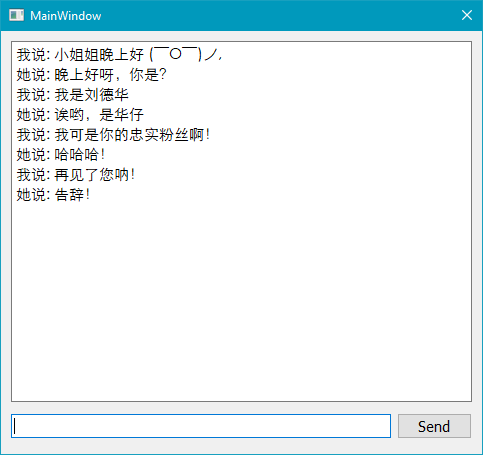

# Distributed Computing Systems_Project

Project repo for course: Distributed Computing Systems

## Project Requirement
- [Requirement](./Requirement.md)

## Progress

### Issues / Ideas (2019/5/2)

- [x] **Messages are sent one by one, next message can be sent only after respond.**
- [x] **How to implement functions in PyQt (for server)?**
- [ ] Sent multi-media files
- [ ] Remotely execute codes/functions/exes
- [ ] GUI Design (像QQ一样的聊天界面（好友头像、聊天框） / 好友列表？)
- [ ] Icon for the GUI
- [ ] Password? ID authentication?
- [ ] Emoji 表情
## XML-RPC

**XML-RPC** is a Remote Procedure Call method that uses XML passed via HTTP as a transport. With it, a client can call methods with parameters on a remote server (the server is named by a URI) and get back structured data.

- [xmlrpc — XMLRPC server and client modules — Python 3.7.3 documentation](https://docs.python.org/3/library/xmlrpc.html)

## PyQt

**PyQt** is a Python binding of the cross-platform GUI toolkit Qt, implemented as a Python plug-in。

- [PyQt - Python Wiki](https://wiki.python.org/moin/PyQt)

## Reference

- [有哪些颜值高的 PyQt/Qt 应用？](https://www.zhihu.com/question/39607624)
- [CORBA体系在网络聊天系统中的实现](./References/CORBA体系在网络聊天系统中的实现_马晓敏.pdf)
- [python rpyc的应用 ——聊天的功能（带认证）](https://my.oschina.net/VASKS/blog/651539)
